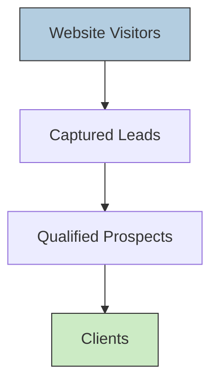

# Executive Summary

To expand data on current clients and attract new ones, a systematic approach is needed. For **existing clients**, we start by auditing what’s known (e.g. name, industry, website) and flag missing fields (e.g. contacts, social profiles, revenue, technology stack). We then enrich each client record via trusted sources – company websites, LinkedIn, Google Business Profiles, business registers and public filings – using both manual checks and automated tools. Key fields to collect include company size, industry, address, decision-maker names, emails/phones, social links and tech stack. All enrichment must respect privacy laws: GDPR/CCPA treat most B2B contacts as personal data, so use lawful bases (legitimate interests or consent) and allow opt-outs. Automation tools (e.g. Clearbit/HubSpot, Apollo, Hunter, RocketReach) and APIs can speed data gathering, while low-cost options (free CRM fields, Google Sheets, scraping libraries) keep budgets small. Throughout, we cross-verify sources and maintain a log of updates. Outreach to clients (email, SMS, LinkedIn) is planned using clear, brief scripts and a very short survey (e.g. 3–5 questions) to request additional information or feedback.

For **new clients**, the strategy balances inbound and outbound channels. Inbound tactics include **SEO** (optimising the website, content marketing and local SEO/Google Business Profile) and **PPC ads** (targeted Google Ads for relevant keywords). For example, Google’s free Business Profile makes firms visible on Search/Maps – many local service businesses report ~40% of leads coming from their profile. Content marketing (blogging, case studies) builds authority over time. Outbound channels include social ads (especially LinkedIn ads or Facebook for B2C segments), email campaigns to vetted lists, and building referral and partner networks (e.g. complementary service providers). Messaging is framed around clients’ needs (e.g. “Modernise your website, reach more customers”) and clear offers. Pricing is packaged into simple tiers (e.g. Basic/Advanced/Premium packages) or retainers, with occasional discounts or bundled services to incentivise conversion. The funnel steps – Awareness (ads, SEO) → Interest (website/content) → Desire (demos, calls) → Action (proposals/contracts) – are tracked with KPIs like website traffic, lead form submissions, conversion rate and revenue. 

A **30/60/90-day plan** operationalises this: in month 1, gather/enrich client data, set up tooling and finalize messaging; month 2, launch SEO improvements and ad campaigns while initiating outreach; month 3, follow up leads, refine targeting, and start partnerships. Key metrics (e.g. number of enriched records, outreach response rates, new leads per channel) are set for each phase. We also address **risks and ethics**: ensuring data collection follows GDPR/PECR rules, avoiding spam (only vetted contacts with opt-out options), and maintaining transparency. 

Finally, we compare recommended tools in a summary table (features, costs, use-cases) and provide sample outreach templates and survey questions in tabular form. The approach relies on authoritative sources (HubSpot, Google, data-compliance guides) and emphasises practical, low-cost solutions (free/basic software, manual checks) suitable for a small business.

## Data Enrichment Playbook for Existing Clients

**1. Audit & Identify Gaps.** Compile all available client data (e.g. from `clients.json`). Note missing fields. Common gaps are contact emails/phones, social media profiles, company size/revenue, industry codes, Google ratings, current website traffic or tech stack. For example, HubSpot’s enrichment capabilities suggest capturing fields like *industry, employee count, revenue range, location, LinkedIn/Facebook URLs, website, founding year, key personnel names/titles*. Missing data might include: primary decision-maker’s name and email, role/seniority, marketing pain points, and any identifiers like company registration number.

**2. Collect from Public Sources.** Use a checklist of free sources:
- **Company Website:** Look for “About Us” or team pages (names/titles), contact pages (phones/emails, even generic). Examine site footer or “News/Blog” for recent developments.
- **Social Media:** Check LinkedIn company pages for firm details (size, headquarters, tagline) and employees (for names/emails). Facebook, Twitter or Instagram profiles may list services, contact info or links to website.
- **Google Business Profile:** Query the business name on Google; a well-maintained Profile shows address, phone, hours, photos, and reviews. As Google notes, a “free Business Profile” helps customers find you. Reviews and Q&A can reveal customer perceptions.
- **Local Directories:** Sites like Yellow Pages, Yelp, Bing Places or industry-specific listings often list basic company data (address, phone, category).
- **Industry Registries:** In some countries, registries (e.g. Companies House in UK) provide official details (registered address, directors, filing history). 
- **Public Filings:** Annual reports or filings (if public companies or certain size) can yield financials or structure.
- **WHOIS/Domain Lookup:** For small businesses with personal registration, WHOIS may list contact email or owner name if not privacy-protected.
- **Review & Job Sites:** Sites like Glassdoor or LinkedIn job postings sometimes mention company size or CEO name. 
- **Competitor Ads & Keywords:** Tools like SEMrush/Moz (free versions) can show competitors, which hints at industry and marketing focus.

Each source may offer overlapping data: e.g. LinkedIn often provides *industry, employee count range, and website*, matching HubSpot’s enrichment targets. Cross-reference to avoid errors. Document source of each data point.

**3. Data Fields to Collect.** Build/update a client profile database with these fields (examples from HubSpot enrichment lists, plus business needs):
- **Identifying Info:** Company name, domain, address, founding year, legal structure (LLP, Ltd, etc).
- **Industry:** SIC/NAICS codes or descriptive sector.
- **Size Metrics:** Number of employees (range), annual revenue range, market served (regional/global).
- **Online Presence:** Official website, Google Business profile link, LinkedIn page, Facebook page, Twitter/Instagram handles.
- **Contacts:** Key personnel (CEO, marketing lead, IT lead) with job titles, emails, direct phones.
- **Business Data:** Short description, core services/products, flagship projects or clients (from case studies/news).
- **Technology & Tools:** Known CMS, e-commerce platform, marketing software (from BuiltWith, Wappalyzer).
- **Marketing Data:** Keywords they rank for (free tools like Ubersuggest), advertising (ads on Google/Facebook), customer reviews.

Keep privacy in mind: note which emails are generic (e.g. info@) vs personal (john@), since generic ones aren’t personal data under GDPR.

**4. Legal & Privacy Considerations.** Even B2B contacts are usually personal data. Ensure compliance:
- **GDPR/PECR (UK/EU):** For any personal email (John.Doe@company.com) or phone, have a lawful basis. Legitimate interest can cover cold outreach if it’s targeted, relevant and balanced by opt-out (perform a Legitimate Interests Assessment). Alternatively, get consent (opt-in). UK PECR allows emailing corporate (non-consumer) addresses without prior consent if you clearly ID yourself and provide opt-outs, but still treat sole-proprietors like consumers. Thus, **always include an unsubscribe** and honour any opt-out immediately. Do not buy or use lists of leads without verification.
- **CCPA/CPRA (California):** If you have California contacts, CCPA may require privacy notice and opt-out for selling/sharing personal info of Californians. Treat B2B emails cautiously under “personal data” rules.

Maintain a record of how data was collected and contacts consented. Purge or anonymise data when no longer needed. Document privacy notice and DPO contacts if required.

**5. Tools & Automation Options.** Depending on budget and skill:
- **Enrichment Services:** Commercial B2B data providers like Clearbit (now part of HubSpot/Breeze Intelligence) or Apollo.io can auto-enrich CRM records (filling fields above). These typically cost hundreds per month. For example, RocketReach offers 100 lookups for ~$69/mo; Apollo has free tiers and ~$59 plans. Free/cheap alternatives include Hunter.io (50 free lookups/mo) and Snov.io (free plan + $30/mo for 50 verifications).
- **Scraping & APIs:** For small budgets, use Python scripts or tools like *Scrapy*, *Beautiful Soup*, or browser automation to scrape public directories and social media. Google’s APIs (Places, Custom Search) can fetch business data. LinkedIn’s API is restricted, but manual LinkedIn profile visits or the free Sales Navigator trial can give contacts.
- **CRMs/Databases:** Store everything in a simple CRM (HubSpot CRM free tier, Zoho CRM, or even Airtable/Excel). Use data-import wizards to append scraped/enriched fields. Ensure duplicates are merged.
- **Time/Cost:** Simple manual lookups (per company) may take 5–15 minutes each for basic data. A batch of 50 clients could take a few person-days. Automated enrichment (with paid tools) reduces time (batch enrichers can process hundreds per hour) but has subscription costs (roughly £20–150/month for small plans). The choice depends on resources: for a “small budget”, mix free trials and manual effort.

**6. Outreach & Survey Design.** Once the database is richer, plan contact. Draft templates for email, SMS and LinkedIn outreach focusing on curiosity and benefit, not pressure. For example, a cold email might say “I noticed [Company] just [launched X]; can I share how our web solutions helped [similar company] grow?“. SMS/LinkedIn messages should be very brief, linking to a short site or calendly. Crucially, include an easy opt-out (“reply STOP to unsubscribe”). For surveys, keep them to ~3–5 quick questions (table below): questions might ask about client satisfaction, services of interest, or unmet needs. Use scaling or multiple-choice to ease response. 

By auditing and filling data gaps, we enable better segmentation (e.g. by industry or size) and more personalized pitches. At each stage, critically review data quality: for instance, verify an email before sending (tools like MailTester) and avoid false assumptions (e.g. don’t email info@ as it may bounce or be forwarded). This “stress-test” ensures our enriched dataset is accurate and our outreach respectful. 

## Lead-Generation Strategy for New Clients

**1. Multi-Channel Approach.** Expand beyond word-of-mouth to proactive marketing:
- **SEO (Search Engine Optimisation):** Optimise the company website (keyword-rich content, meta tags, fast loading). Publish helpful content (blogs, case studies, whitepapers) targeting terms like “small business website builder” or “local digital marketing agency”. Good SEO is long-term but cost-effective. Also leverage **Local SEO**: ensure Google Business Profile is set up and optimised (category, services, photos). As Google advises, a *free Business Profile* can turn searchers into customers. Encouraging reviews boosts credibility.
- **PPC (Pay-Per-Click Ads):** Run targeted Google Ads campaigns. For a digital agency, use search ads (e.g. keywords “build website [location]”) and display or remarketing to visitors. Define clear budget caps (small clients might spend £5–20/day initially). Social media ads (e.g. LinkedIn Sponsored Content for B2B or Facebook/Instagram for local B2C sectors like retail shops) can boost visibility. Monitor cost-per-lead (CPL) to avoid overspending.
- **Social Media & Content Marketing:** Maintain an active presence on LinkedIn and industry forums. Post portfolio highlights, tips or short videos to demonstrate expertise. Consider gated content: e.g. a downloadable “Website Redesign Checklist” behind a form, capturing leads. This inbound magnet can cost little besides time.
- **Referrals:** Systematically ask happy clients for referrals or reviews. Implement a simple referral programme or request testimonials to share on site and Google. Often overlooked, warm referrals convert best.
- **Partnerships & Networking:** Partner with non-competing businesses (e.g. graphic designers, IT consultants) for cross-referrals. Attend or host local business events, webinars or meetups. For a small agency, one well-targeted event (even an online meetup) can yield high-quality leads with modest cost.
- **Email Marketing:** Use the enriched client list to send occasional newsletters or offers (with GDPR compliance). Segment lists by interest (e.g. existing clients vs prospects vs cold leads) and tailor messaging. Automation tools (like Mailchimp’s free plan) can manage campaigns and track opens/clicks.

**2. Targeting & Messaging.** Define target criteria: industries that often need digital services (retail, hospitality, professional services), company size (e.g. 1–50 employees), and geographic scope (local vs remote). Use any data gained from existing clients to refine Ideal Customer Profile. Messaging frameworks: highlight problems and solutions clearly (e.g. “Struggling with slow leads? A new website can increase conversions by X%.”). Test formats like “problem-agitate-solve” or “before-after” in copy. Use social proof (testimonials, case stats).

**3. Pricing/Packaging.** Offer clear, tiered packages (e.g. “Starter” site vs “Pro” site vs “Premium with SEO”), or monthly retainers (basic maintenance vs full digital marketing). Price competitively for small budgets, perhaps offering an introductory discount or bundling services. Clearly state deliverables and timelines to avoid confusion.

**4. Conversion Funnel.** Map the funnel and track it. A simple funnel:

- **Awareness (Top):** SEO rankings, social reach, ad impressions, event attendees.
- **Interest (Middle):** Measure clicks, content downloads, form submissions, demo requests.
- **Decision (Bottom):** Proposal sends, consultations booked, deals closed.
  
Key metrics (KPIs) might include: organic traffic, leads per channel, landing page conversion rate, cost per acquisition (CPA), and client churn. For example, a goal could be “30 new leads and 3 signed clients in 90 days”.

**5. Testing & Iteration.** Regularly review which channels yield the best ROI. If PPC spending produces few qualified leads, adjust keywords or budgets. If a blog post attracts views, promote more similar content. Always stress-test assumptions: an idea of “everyone uses Google Ads” might break if local search volume is low, so be ready to pivot to social ads or direct outreach. 

By combining inbound SEO/content with targeted ads and proactive networking, the strategy diversifies risk. Even if one channel underperforms (e.g. low click-through on LinkedIn ads), others (like referrals or local SEO) can compensate. This rigorous multi-pronged plan, with measurable goals, helps a small digital agency steadily generate and convert new leads.

## 30/60/90-Day Action Plan (with KPIs)

```mermaid
gantt
    title 30/60/90-Day Plan
    dateFormat  YYYY-MM-DD
    section Days 1–30: Data & Setup
    Audit existing client data        :done,    2026-10-01, 10d
    Identify missing fields          :active,  2026-10-11,  5d
    Enrich data (manual+tools)       :         2026-10-16, 10d
    Set up CRM/automation tools      :         2026-10-26,  5d
    Draft outreach templates/survey  :         2026-10-31,  5d
    KPI targets: Enriched records ≥X%, outreach templates ready.
    section Days 31–60: Outreach & Launch
    Finalise lead-gen messaging      :done,    2026-11-01,  5d
    Start SEO improvements (on-page) :active,  2026-11-06, 15d
    Launch PPC/social ad campaigns   :         2026-11-21, 10d
    Begin client outreach (email/SMS):         2026-11-21, 10d
    KPI targets: Website visits ↑10%, ≥Y leads generated.
    section Days 61–90: Optimize & Scale
    Analyse lead sources & results   :done,    2026-12-01,  5d
    Refine targeting (ads/SEO)       :active,  2026-12-06, 10d
    Expand content marketing         :         2026-12-16, 10d
    Pursue referrals & partnerships  :         2026-12-16, 10d
    Review & adjust pricing/offers   :         2026-12-26,  5d
    KPI targets: ≥5 new clients/month, ROI ≥ target.

```
- **Days 1–30:** Focus on data. Complete the client database audit (with ≥90% of records having updated contacts and profiles). Set up or refine the CRM and enrichment tools. Finalise email/SMS/LinkedIn scripts and a 3-question survey to fill remaining gaps.
- **Days 31–60:** Begin marketing activity. On the website, implement SEO fixes and publish initial blog(s). Launch ads with small test budgets, measuring CPL. Send the first wave of outreach. Monitor website analytics and lead forms daily.
- **Days 61–90:** Evaluate. See which channels produce leads (e.g. if Google Ads got 3 leads vs LinkedIn 0). Double down on effective ones, adjust or pause others. Continue nurturing hot leads from outreach. Aim by day 90 to have a steady stream of new leads per week (for example, 10 qualified leads/month) and at least 2–3 closed deals. 

Progress is tracked by metrics: enriched contact % (aim ≥80%), open/response rates of outreach (e.g. ≥15%), leads generated per channel (target as per budget), and ultimately, number of proposals and signed contracts. Regular weekly reviews ensure we “stress-test” tactics – for instance, if email open rates fall below 10%, revise subject lines; if SEO rankings haven’t budged, add more backlinks or technical fixes. 

## Risks and Ethical Considerations

- **Data Privacy Compliance:** As noted, almost all B2B contacts are treated as personal data under GDPR. We must not hoard unnecessary personal info or continue contacting those who opt-out. All outreach must include an unsubscribe and clear identity of sender. When using any purchased or scraped list, verify that it was obtained legally and that contacts are relevant (avoiding outdated or irrelevant leads). Under UK PECR, even B2B emails need care: only use soft-opt-in (marketing to past clients) properly, and be especially cautious with sole traders (who count as individuals).
- **Spam and Reputation:** Sending too many cold emails can hurt sender reputation and deliverability. Mitigation: keep messages personalised and minimal, limit batch sizes, and use email warm-up tools if blasting cold emails. Track bounce rates and remove bad addresses.
- **Accuracy of Data:** Automated tools may add outdated or incorrect info (for example, RocketReach or Clearbit sometimes guess jobs). Always double-check key facts before pitching. Incorrect data (e.g. wrong industry) can undermine credibility.
- **Platform Terms:** Scraping some platforms (e.g. LinkedIn profiles or Google Maps) violates terms of service and could lead to IP blocks or legal issues. Prefer official APIs where possible and comply with robots.txt. For example, use Google’s Place API instead of scraping Google Maps directly.
- **Bias & Ethics:** Ensure target criteria and messaging do not discriminate. Avoid using sensitive personal data. When seeking surveys/feedback, assure clients their honest opinions are welcomed and data will be anonymised. 
- **Over-Promise Risk:** In conversion tactics, do not promise unrealistic results (e.g. guaranteed rank #1 on Google) to win clients; this builds distrust. Use case studies cautiously (e.g. “Client X saw 50% more traffic in 6 months” with citation of source or disclaimer).
- **Dependence Risk:** Don’t rely entirely on one channel. For instance, if Google Ads budget is exhausted or an algorithm change hits organic search, the pipeline could dry up. The multi-channel plan mitigates this by diversification.

By anticipating these issues (data protection, spam, accuracy, compliance), we build mitigation: documented consent basis, opt-out management, manual validation steps, and ethical messaging. This not only avoids penalties (like GDPR fines) but builds trust with prospects. 

## Tools & Services Comparison

| Tool / Service        | Purpose                  | Key Features                              | Pricing (approx.)          | Best Use-Case                        |
|-----------------------|--------------------------|-------------------------------------------|----------------------------|--------------------------------------|
| **HubSpot (CRM/Breeze)** | CRM & Data Enrichment | Free CRM, contact/company fields, email sequences; Breeze (Clearbit) enriches records with firmographics | Free (CRM); Enrichment via paid plan (Clearbit legacy ≥$45/mo) | Centralise contacts, auto-enrich inbound leads |
| **RocketReach**       | Contact Finder           | Large database (700M profiles), emails/phones; org charts | ~$69/mo for 100 lookups (Essentials) | Finding verified emails/phones for outbound |
| **Apollo.io**         | Prospecting & Outreach   | B2B contact database, email finder; sequence campaigns; CRM integration | Free tier (75 credits); from ~$59/mo | Unified lead search and email outreach |
| **Hunter.io**         | Email Finder/Verifier    | Domain search for emails, bulk finder; email verification | Free plan (25–50 searches/mo); $49/mo | Quick email lookup by company or name |
| **Snov.io**           | Email Outreach Toolkit   | Email finder, verifier, drip campaigns; CRM | Free plan (limited credits); $30–$39/mo for basic | Affordable all-in-one for small teams |
| **Mailshake / Woodpecker** | Email Campaigns      | Automated cold-email sequences, warm-up, analytics | Mailshake from ~$29/mo; Woodpecker from ~$35/mo | Scalable outreach with follow-ups |
| **Google Business Profile** | Local SEO & Visibility | Free listing on Google Search/Maps; reviews and posts | Free                        | Attract local clients and appear in map searches |
| **LinkedIn Sales Navigator** | B2B Lead Search    | Advanced filters, InMail credits, lead recommendations | From ~$90/mo (per user)      | Targeted search for high-value B2B leads |
| **Google Analytics / Ads** | Web Analytics & Ads  | Traffic analysis; PPC campaign management; lead tracking | Free (Analytics); Ads pay-per-click | Data-driven SEO/SEM and ROI tracking |
| **ZoomInfo / Crunchbase** | Company Data & Insights | Detailed firmographics, funding, tech stack (ZoomInfo); startup profiles (Crunchbase) | ZoomInfo custom quotes (expensive); Crunchbase Pro ~$29/mo | Researching larger prospects or competitors |
| **Python / Open Tools** | Custom Scraping & Auto | Libraries (Scrapy, Selenium), APIs (Clearbit, Google) for custom enrichment | Free (open-source); API costs vary | Automating niche data collection within TOS limits |

*Sources:* Pricing and features from vendor documentation and reviews. The table focuses on practical tools: free CRM (HubSpot) and APIs for data; affordable email finders (Hunter, Snov); outreach platforms (Mailshake, Woodpecker); and paid solutions (RocketReach, LinkedIn) for when budgets allow. Always consider trial periods and small plans first.

## Outreach Templates & Survey

Below are sample outreach scripts and a brief survey (table format) to gather missing client info:

| Channel   | Template (Example)                                                                                                                                                                            |
|-----------|----------------------------------------------------------------------------------------------------------------------------------------------------------------------------------------------|
| **Email** | *Subject:* Grow [Client]’s online reach?<br>*Body:* Hi [Name],<br><br>I noticed [Client] recently [event/promotion]. We helped a similar business improve their website and boost inquiries by 40%. Would you be open to a quick chat about how we might do the same for you? I promise it will be worth 10 minutes of your time.<br><br>Best regards,<br>[Your Name], [Agency]<br>[Phone] / [Website] *(P.S. Reply “STOP” to unsubscribe)* |
| **SMS**   | *Message:* Hi [Name], [Your Name] here from [Agency]. We helped [Similar Business] get 50% more leads via a new site. Free chat? Reply Y/N. *(Msg frequency: ~2/month; reply STOP to opt-out)*                                    |
| **LinkedIn** | *Connect Note:* Hi [Name], I’m a digital consultant working with companies like [Client’s Industry Peer]. Would love to connect and share a quick tip about [digital marketing point]. — [Your Name]             |

| **Survey Question**                | **Type / Options**                     |
|------------------------------------|----------------------------------------|
| 1. How satisfied are you with our current service? | Rating (1–5 stars) or "Very satisfied / Neutral / Dissatisfied" |
| 2. Which of these services interest you most?       | Multi-select (e.g. Website design; SEO; Social ads; Analytics)   |
| 3. What is your preferred contact method?           | Single choice (Email / Phone / SMS / Other)                     |
| 4. Are there any other businesses you think we should help? (Referrals) | Open text                                             |

The templates are concise and client-focused: they highlight a benefit (e.g. “boost inquiries 40%”) and invite engagement, while providing an opt-out. The survey is ultra-short (4 questions) to respect client time, gathering actionable insights (satisfaction, interest areas, contact preference, referrals). Responses can fill data gaps (e.g. preferred contact info) and signal upsell opportunities.

**Note:** Personalise each outreach with the client’s or prospect’s name and specific detail. Always test subject lines/times for best open rates. Keep the tone professional and helpful – our aim is to **stress-test** clients’ interest, not to push unwanted sales. 

